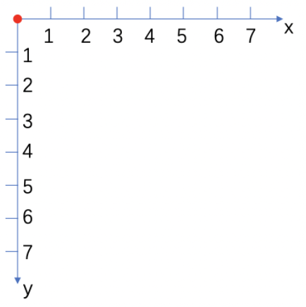

# 强化学习实战：基于DQN玩Flappy Bird（keras版）

本文主要是基于DQN（Deep Q Network）思想，利用keras训练model，实现机器自主学习玩Flappy Bird的过程。

本文主要分为两章：
- Flappy Bird游戏实现
- DQN理论与实现

大佬们可以根据需要自行选择章节进行阅读，源码、最终训练model及评测报告附在文末。

## 一、Flappy Bird游戏实现
Flappy Bird是一款2014年火爆全球的一款简单小游戏，其主要操作方式是通过手指触碰屏幕，从而使小鸟及时准确地跨越管道。

主要分为以下几步：
1. 加载图像资源
2. 计算撞击域
3. 设定全局参数
4. 游戏初始化
5. 渲染
6. 接受指令并计算下一帧图像
7. 计算得分
8. 游戏是否能继续：
  - 能：**5.渲染**
  - 不能：**4.游戏初始化**

### 1.加载图片资源
首先，我们从加载必要的图像资源开始：
```python
# ---------------  资源路径  -----------------
# base_path
BASE_PATH = os.path.split(os.path.abspath(__file__))[0]
# 背景图片（上半部分，黑色背景）
BACKGROUND_PATH = os.path.join(BASE_PATH, 'resources/images/background-black.png')
# 背景图片（下半部分，绿色草坪）
LAWN_PATH = os.path.join(BASE_PATH, 'resources/images/lawn.png')
# 小鸟飞：上 中 下
BIRD_PATH = (
    os.path.join(BASE_PATH, 'resources/images/redbird-upflap.png'),
    os.path.join(BASE_PATH, 'resources/images/redbird-midflap.png'),
    os.path.join(BASE_PATH, 'resources/images/redbird-downflap.png')
)
# 管道
PIPE_PATH = os.path.join(BASE_PATH, 'resources/images/pipe-green.png')

# ---------------  加载图片  -----------------
# 初始化容器
images = {}
# 背景
images['background'] = pygame.image.load(BACKGROUND_PATH).convert()
# 草坪
images['lawn'] = pygame.image.load(LAWN_PATH).convert_alpha()
# 小鸟
images['bird'] = [
    pygame.image.load(BIRD_PATH[i]).convert_alpha() for i in range(len(BIRD_PATH))
]
# 管道，上下两根
images['pipe'] = (
    pygame.transform.rotate(
        pygame.image.load(PIPE_PATH).convert_alpha(), 180),
    pygame.image.load(PIPE_PATH).convert_alpha(),
)
```
### 2.计算撞击域
由于我们使用的图片资源都是矩形，但实际对象是任意形状的，这时我们需要计算每个物体在图片矩形中实际的占位情况，如下图所示：


彩色区域为小鸟对象的实际占位情况即撞击域；周围灰色像素（实际为透明像素）则是非撞击域，与其他对象的撞击域重合时不会发生碰撞。只有当对象间的撞击域重合时，才会发生碰撞。后续为了判断小鸟与管道是否发生碰撞需要计算撞击域：

```python
# 计算撞击域
def get_hit_mask(image):
     mask = []
     for x in range(image.get_width()):
         mask.append([])
         for y in range(image.get_height()):
             # 最后一维 为透明度
             # (255, 255, 255, 0) 0，透明，不发生碰撞
             # (84, 56, 71, 255) 非0，不透明，碰撞
             mask[x].append(bool(image.get_at((x, y))[3]))
     return mask

hit_masks = {}
# 小鸟
hit_masks['bird'] = [get_hit_mask(images['bird'][i]) for i in range(len(images['bird']))]
# 管道
hit_masks['pipe'] = [get_hit_mask(images['pipe'][i]) for i in range(len(images['pipe']))]
```
### 3.设定全局参数
设定游戏的全局参数（在多轮游戏中保持不变）：
```python
# 画布大小
self.screen_width = 288
self.screen_height = 512
# 刷新率
self.fps = 30
# pygame设定
pygame.init()
self.fps_clock = pygame.time.Clock()
self.screen = pygame.display.set_mode((self.screen_width, self.screen_height))
pygame.display.set_caption('Flappy Bird')
# 加载图片资源
self.images = self.load_image_resources()
# 计算撞击域
self.hit_masks = self.compute_hit_masks(self.images)
# 草坪的位置
self.lawn_y = self.screen_height * 0.79
# 三只不同形态的鸟 宽高一致，故不分
self.bird_width = self.images['bird'][0].get_width()
self.bird_height = self.images['bird'][0].get_height()
# 管道高度
self.pipe_width = self.images['pipe'][0].get_width()
self.pipe_height = self.images['pipe'][0].get_height()
# 管道上下最小间距，理论上，要允许让 bird 通过
self.pipe_min_gap = 100
# 速度设定
self.bird_max_vel_y = 10  # bird 最大自由落体速度（下的快)
self.bird_min_vel_y = -8  # bird 最大向上flappy速度（上的慢)
self.bird_acc_y = 1  # bird 自由下落的加速度
self.bird_flap_acc = -9  # bird 拍拍翅膀的加速度
self.pipe_vel_x = -4  # 管道 x轴 固定移动速度，y轴不动
```
这里简单介绍下图像游戏中坐标系，帮助读者理解画布和各对象的运动参数：



左上角为坐标原点，x轴向右为横轴增长方向，y轴向左为纵轴增长方向。

这里对小鸟和管道的物理运动参数做下特别的说明：
- 管道：匀速向左移动，故速度为负常数。
- 小鸟：自由落体速度向下，故为正数；拍翅膀上升速度向上，故为负数。

### 4.游戏初始化
在没有接收到玩家的操作指令时，初始化本轮中的状态参数（得分、速度）以及与位置相关的坐标参数。

先将必要的状态参数初始化：
```python
self.score = 0 # 得分
self.bird_vel_y = 0  # bird 当前速度，刚进入时为0
```

对于小鸟来说，我们将其初始坐标设置在屏幕(20%,50%)处，并指定其初始姿态：
```python
# 起始 bird 位置
self.bird_x = int(self.screen_width * 0.2)
self.bird_y = int((self.screen_height - self.bird_height) / 2)
# bird 编号（对应不同动作的bird）
self.bird_index = 0
```

在确定管道的坐标参数之前，需要先随机生成管道：
```python
# 随机生成一根管道
def generate_random_pipe(self):
    # init
    pipe_y = int(self.lawn_y * 0.2)  # 管道起始位置，在草坪上方区域 0.2 的位置

    # random
    random_ys = [20, 30, 40, 50, 60, 70, 80, 90]
    index = random.randint(0, len(random_ys) - 1)
    pipe_y += random_ys[index]

    pipe_x = self.screen_width + 10  # 在屏幕外等着，暂未展示

    return [
        {'x': pipe_x, 'y': pipe_y - self.pipe_height},  # 上管道坐标
        {'x': pipe_x, 'y': pipe_y + self.pipe_min_gap},  # 下管道坐标
    ]
# 初始生成两组管道，这里随机生成其高度y， x相对固定
init_pipe_1 = self.generate_random_pipe()
init_pipe_2 = self.generate_random_pipe()
```

游戏开始时，生成两组（上下）管道，都在屏幕外，且两组管道相距半个屏幕宽：
```python
self.upper_pipes = [
    {'x': self.screen_width, 'y': init_pipe_1[0]['y']},
    {'x': self.screen_width + (self.screen_width / 2), 'y': init_pipe_2[0]['y']},
]
self.lower_pipes = [
    {'x': self.screen_width, 'y': init_pipe_1[1]['y']},
    {'x': self.screen_width + (self.screen_width / 2), 'y': init_pipe_2[1]['y']},
]
```
### 5.渲染
在确定所有对象的坐标后，就可以进行渲染了：
```python
# 背景
self.screen.blit(self.images['background'], (0, 0))

# 管道
for uPipe, lPipe in zip(self.upper_pipes, self.lower_pipes):
    self.screen.blit(self.images['pipe'][0], (uPipe['x'], uPipe['y']))
    self.screen.blit(self.images['pipe'][1], (lPipe['x'], lPipe['y']))

# bird
self.screen.blit(self.images['bird'][self.bird_index],
                 (self.bird_x, self.bird_y))

# 草坪
self.screen.blit(self.images['lawn'], (0, self.lawn_y))

image_data = pygame.surfarray.array3d(pygame.display.get_surface())
pygame.display.update()
self.fps_clock.tick(self.fps)
```

### 6.接受指令并计算下一帧图像
首先，我们考虑操作指令的影响，其核心逻辑在于改变小鸟的垂直速度`bird_vel_y`，并保证速度不会超出阈值：
```python
# input_actions[0] == 1: 不动
# input_actions[1] == 1: 拍拍翅膀
if input_actions[1] == 1:
    # 拍翅膀
    if self.bird_vel_y > self.bird_min_vel_y:
        self.bird_vel_y = max(self.bird_vel_y + self.bird_flap_acc, self.bird_min_vel_y)
else:
    # 没拍翅膀，自由落体
    if self.bird_vel_y < self.bird_max_vel_y:
        self.bird_vel_y = min(self.bird_vel_y + self.bird_acc_y, self.bird_max_vel_y)
```
随后可以参照当前速度来更新其垂直坐标`bird_y`:
```python
# 更新当前 bird y轴 坐标
# min 不可能超出 草坪 边界！
# max 不可能突破天际！
self.bird_y = max(min(self.bird_y + self.bird_vel_y, self.lawn_y - self.bird_height), 0)
```
注意更改小鸟的姿态（拍翅膀）：
```python
# 总共三种姿态的bird
self.bird_index = (self.bird_index + 1) % 3
```
同时，管道也会发生左移：
```python
# 管道左移
for uPipe, lPipe in zip(self.upper_pipes, self.lower_pipes):
    uPipe['x'] += self.pipe_vel_x
    lPipe['x'] += self.pipe_vel_x
```
考虑管道的消失与新增：
```python
# 新增管道，当第一个管道快消失时，考虑添加新管道
if 0 < self.upper_pipes[0]['x'] < 5:
    new_pipe = self.get_random_pipe()
    self.upper_pipes.append(new_pipe[0])
    self.lower_pipes.append(new_pipe[1])
# 第一个管子消失
if self.upper_pipes[0]['x'] < -self.pipe_width:
    self.upper_pipes.pop(0)
    self.lower_pipes.pop(0)
```
### 7.计算得分
在得到小鸟和管道在下一帧的坐标后，可以计算其得分：
```python
# 检查当前是否越过管道，并更新 score
bird_mid_pos_x = self.bird_x + self.bird_width / 2
for pipe in self.upper_pipes:
    pipe_mid_pos_x = pipe['x'] + self.pipe_width / 2
    # 刚好越过管道
    if pipe_mid_pos_x <= bird_mid_pos_x < pipe_mid_pos_x + 4:
        self.score += 1
```
### 8.游戏是否能继续
即小鸟是否与管道、屋顶、草坪发生碰撞：
```python
# 检查是否撞到管道
def check_crash(self, bird, upper_pipes, lower_pipes):
    bird_index = bird['index']
    bird_x = bird['x']
    bird_y = bird['y']

    def pixel_collision(rect1, rect2, hit_mask1, hit_mask2):
        # 两个矩形不相交，直接pass
        rect = rect1.clip(rect2)

        if rect.width == 0 or rect.height == 0:
            return False

        x1, y1 = rect.x - rect1.x, rect.y - rect1.y
        x2, y2 = rect.x - rect2.x, rect.y - rect2.y

        for x in range(rect.width):
            for y in range(rect.height):
                if hit_mask1[x1 + x][y1 + y] and hit_mask2[x2 + x][y2 + y]:
                    return True
        return False

    # 撞到屋顶
    if bird_y == 0:
        return True
    # 掉到地上
    elif bird_y + self.bird_height >= self.lawn_y:
        return True
    else:
        bird_rect = pygame.Rect(bird_x, bird_y, self.bird_width, self.bird_height)
        for u_pipe, l_pipe in zip(upper_pipes, lower_pipes):

            # upper and lower pipe rects
            u_pipe_rect = pygame.Rect(u_pipe['x'], u_pipe['y'], self.pipe_width, self.pipe_height)
            l_pipe_rect = pygame.Rect(l_pipe['x'], l_pipe['y'], self.pipe_width, self.pipe_height)

            # player and upper/lower pipe hitmasks
            bird_hit_mask = self.hit_masks['bird'][bird_index]
            u_hitmask = self.hit_masks['pipe'][0]
            l_hitmask = self.hit_masks['pipe'][1]

            # if bird collided with upipe or lpipe
            u_collide = pixel_collision(bird_rect, u_pipe_rect, bird_hit_mask, u_hitmask)
            l_collide = pixel_collision(bird_rect, l_pipe_rect, bird_hit_mask, l_hitmask)

            if u_collide or l_collide:
                return True

    return False

is_crash = self.check_crash({'x': self.bird_x, 'y': self.bird_y,
                               'index': self.bird_index},
                              self.upper_pipes, self.lower_pipes)
```
如果发生，碰撞则重新开始（**4.游戏开始**），否则将当前这帧渲染（**5.渲染**）。
## 二、DQN理论与实现
### 理论
在下基础知识有限，仅关注应用层，理论不做过多的推导（也不能-.-||）

首先，从最基本强化学习模型讲起，引用网上的一张图片来简单解释下：


主要包含两部分：
- 智能体：从外界环境中获得观察observation，思考后做出行为action
- 环境：外界环境根据智能体作出的action发生相应的变化，并反馈给智能体当前环境的评价reward

强化学习大致流程：
1. 智能体observe环境，思考后做出行为action
2. 环境接收action，做出变化
3. 根据变化后的环境，评价这次action的reward，并训练智能体，使其更聪明
4. 返回1

至于DQN，笔者认为其核心在于其计算reward的方式上：
- DQN提出一个函数，用于衡量，在observation一定时，采取不同action，所获得的reward：
即theory_reward=Q(observation,action)
- 针对theory_reward，DQN做出了进一步推导
  - 当游戏结束时，theory_reward=当前action所带来的reward
  - 当游戏仍能进行时，theory_reward=当前action所带来的reward+γ*下一步最大可能取得的theory_reward，γ为<1的折扣系数

再直观些，即每步reward除了考虑当前action实际获得的reward，还要展望未来的reward。

现在来设计我们的model（大脑）。


借鉴了网上有关DNQ的代码，并做了一定的改进：
1. 利用最近4帧图像作为输入（初始最近4帧一致）
2. reshape => 80x80x4
3. 32个(4x4)的卷积核 => 20x20x32
4. (2x2)的pooling => 10x10x32
5. 64个(2x2)的卷积核 => 5x5x64
6. 拉成一维
7. 256全连接
8. 线性输出2个action所对应的reward

我们放弃了最后的一次的卷积与pooling，改成直接连接全连接层。
### 实现
#### 模型
首先，我们按照上面的思路，来设计我们的model：
```python
model = Sequential()
model.add(Conv2D(32, kernel_size=4, strides=(4, 4), input_shape=(80, 80, 4), activation='relu'))
model.add(MaxPooling2D(pool_size=(2, 2)))
model.add(Conv2D(64, kernel_size=2, strides=(2, 2), activation='relu'))
model.add(MaxPooling2D(pool_size=(2, 2)))
model.add(Flatten())
model.add(Dense(256, activation='relu'))
model.add(Dense(2, activation='linear'))
```
注意最后一层，用的是线性回归，主要考虑我们最后的reward可能>1，所以用线性更加合理。

#### 参数
这里参数主要与DNQ算法有关：
- epsilon：随机行为阈值，每次进行action时，会随机丢个骰子，若<epsilon，则会进行随机行为。随机行为会带来不稳定性，但能更好的探索更优解。epsilon随着时间的流逝会逐步减小至min，代表着模型渐渐稳定，且仍具有一定的探索能力。
- memory：资源是有限的，只能存储有限的经验，这里是指(当前状态, action, 下一状态, reward, 是否终止)的五元组。
- gamma：未终止时，未来奖励带来reward的折扣系数。
- step：第几帧，除了关系到epsilon的降低，还与何时开始训练model相关，攒够的足够的样本才开始训练。
- batch_size：训练批次大小。

```python
self.epsilon_init = 0.01  # epsilon 的 init
self.epsilon_min = 0.0001  # epsilon 的 MIN
self.epsilon = self.epsilon_init  # epsilon 代表采取随机行为的阈值
self.epsilon_decay_step = 300000  # epsilon 衰减的总步数
self.step = 0
self.observation_step = 50000  # 观察多少步后，开始降低随机性
self.memory_size = 50000  # 记忆容量
self.gamma = 0.99  # 未来奖励 折扣系数
self.memory = deque()
self.batch_size = 32
```
#### 训练
##### 1.初始化
首先，需要指定初始状态，为我们的model提供输入，这里将游戏第一帧图像处理并叠加作为网络的输入，这里主要考虑：
1. reshape：将图像尺寸转为我们网络接受的尺寸
2. 二值化：针对该问题，图像元素只取0、1便可满足我们的训练，并加快训练
3. 图像叠加：网络是接受最近4帧的图像

```python
# 1.缩放（可以不用，考虑到资源有限还是缩放比较好）
resize_image_data = cv2.resize(image_data, (80, 80))
# 2.1.转化成灰色图片
gray_image_data = cv2.cvtColor(resize_image_data, cv2.COLOR_BGR2GRAY)
# 2.2.转化成二值图片（供神经网络训练用）
_, binary_image_data = cv2.threshold(gray_image_data, 1, 1, cv2.THRESH_BINARY)
# 3.堆叠4帧图像到同一（x,y）上
self.current_state = np.stack((binary_image_data, binary_image_data, binary_image_data, binary_image_data), axis=2)
```
##### 2.获得action
实质上，是model根据当前状态，预测未来各个行为（拍翅膀、不拍翅膀）的reward，并取其中最大reward所对应的action，作为下一action。

同时，这里加入了随机性，增大更优解的探索空间，具体来说是，随机丢骰子，若<epsilon，则会进行随机行为，否则会利用model做出理性判断。

```python
action = np.zeros(2)
if random.random() <= self.epsilon:
    # 采取真随机行为
    action_index = random.randrange(2)
    action[action_index] = 1
else:
    # 采取经验行为
    result = self.model.predict(self.current_state[np.newaxis, :, :, :])[0]
    action_index = np.argmax(result)
    action[action_index] = 1
```

##### 3.做出action，并获得reward

结合游戏环境，做出action，获得下一帧的状态，并计算reward。

主要考虑reward，action所引起的游戏渲染这里不再考虑，参见*Flappy Bird游戏实现*

原始模型中，reward有3种：

- 越过管道：1
- 游戏尚未结束：0.1
- 游戏结束：0

除此之外，还加入了额外的reward（作弊）：

- 与下一对管道中心的偏移程度：偏移程度越大，越容易撞，则extra_reward越小
- 绝对速度大小：越大越不容易改变方向，越容易撞，则extra_reward越小

```python
reward = 0
# 1. bird 位于下一目标管道的中间
# 前方最近的pipe
right_nearest_pipe = None
for pipe in self.upper_pipes:
    if pipe['x'] > self.bird_x + self.bird_width:
        distance = pipe['x'] - (self.bird_x + self.bird_width)
        if right_nearest_pipe is None or right_nearest_pipe['x'] - (self.bird_x + self.bird_width) > distance:
            right_nearest_pipe = pipe

min_distance = right_nearest_pipe['x'] - (self.bird_x + self.bird_width)
# bird 在两管道之间
if right_nearest_pipe['y'] + self.pipe_height < self.bird_y < right_nearest_pipe[
                'y'] + self.pipe_height + self.pipe_min_gap - self.bird_height:
	pos_reward = 0.5 * (1 - 1.0 * min_distance / self.screen_width / 2)
else:
	pos_reward = -0.5 * (1 - 1.0 * min_distance / self.screen_width / 2)
reward += pos_reward

# 2. bird 的速度不能太快，太快不容易刹车
speed_reward = -0.5 * abs(self.bird_vel_y) / 10
reward += speed_reward
```

实际测试，以上extra_reward能帮助模型更快的收敛。

```python
image_data, reward, terminal, final_score = game.action_and_reward(action)
```

##### 4.更新状态，并训练模型

状态主要指包括：
- 当前维护的最近4帧状态
- model的memory
- step第几帧

```python
# 取出当前一帧
next_frame = self.image2frame(image_data)
# 当前一帧做第一帧，后面三帧从原来取
next_state = np.append(np.reshape(next_frame, (80, 80, 1)), self.current_state[:, :, :3], axis=2)
self.memory.append((self.current_state, action, next_state, reward, terminal))
if len(self.memory) > self.memory_size:
	self.memory.popleft()
if self.step > self.observation_step:
	self.train_model()
self.current_state = next_state
self.step += 1
```

更新完必要的状态后，可以来训练我们的model，基本上与我们前面在理论部分写的一致：
```python
# 可能 sample 不出 BATCH 个样本
mini_batch = random.sample(self.memory, min(len(self.memory), self.batch_size))
X = np.zeros((len(mini_batch), 80, 80, 4))
y = np.zeros((len(mini_batch), 2))
# replay experience
for i in range(0, len(mini_batch)):
    memory_state = mini_batch[i][0]
    action_index = np.argmax(mini_batch[i][1])
    next_memory_state = mini_batch[i][2]
    reward = mini_batch[i][3]
    terminal = mini_batch[i][4]
    X[i] = memory_state
    if terminal:
        y[i, action_index] = reward
    else:
        Q = self.model.predict(next_memory_state[np.newaxis, :, :, :])[0]
        y[i, action_index] = reward + self.gamma * np.max(Q)

loss = self.model.train_on_batch(X, y)
```

然后我们可以返回到**2.获得action**，进行反复训练，最后得到相对稳定的模型。

# Result

- cnn+：使用额外的reward
- cnn：不使用额外的reward


参考：

- [yenchenlin/DeepLearningFlappyBird](https://github.com/yenchenlin/DeepLearningFlappyBird)